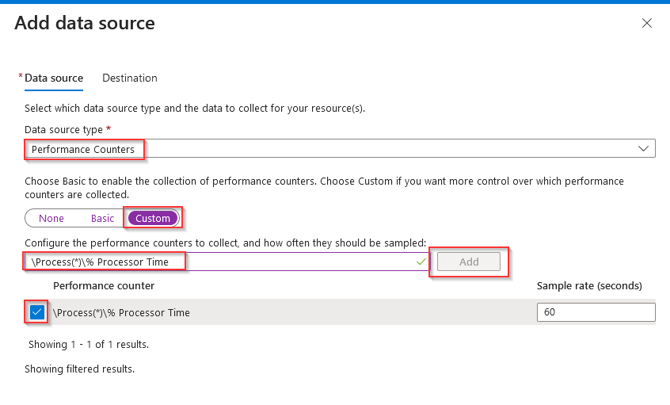
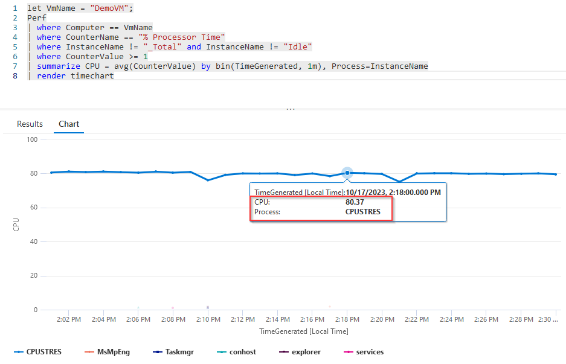

# Monitor VM process CPU utilization using Azure Monitor

Troubleshooting performance issues on Virtual Machines can be a tedious and time consuming process. Using Azure Monitor, gain visibility into guest-level performance metrics like CPU utilization at the process level to determine which process is responsible for high CPU utilization.

## Prerequisites

- Azure Log Analytics Workspace [(create a workspace)](https://learn.microsoft.com/en-us/azure/azure-monitor/logs/quick-create-workspace?tabs=azure-portal)
- Azure Windows VM [(deploy an Azure VM)](https://learn.microsoft.com/en-us/azure/virtual-machines/windows/quick-create-portal)
- VM Contributor and Monitor Contributor

## Create a Data Collection Rule

Deploying [DCR.bicep](DCR.bicep) will create a Data Collection Rule with the appropriate counters and an association to a single Virtual Machine to monitor. Alternatively, follow the steps below to deploy using the portal or other methods.

Follow [this guide](https://learn.microsoft.com/en-us/azure/azure-monitor/agents/data-collection-rule-azure-monitor-agent?tabs=portal) to deploy a Data Collection Rule using the Azure Portal. Add the VM that needs to be monitored as a Resource. Configuring the VM as a Data Collection Endpoint is optional.

The Data Source will be ```Perforamnce Counters``` and will include a custom Data Source for a counter named  ```\Process(*)\% Processor Time```. To add a custom Data Source, select the ```custom``` tab, enter the counter name, and select the checkbox next to the counter.



In Destination, selectAzure Monitor Logs and the Log Analytics Workspace name.

## Monitor VMs

Navigate to the Log Analytics Workspace -> Logs. Enter the query below, updating line 1 to the name of the VM that is associated to the Data Collection Rule

```Kusto
let VmName = "NameOfVm";
Perf
| where Computer == VmName
| where CounterName == "% Processor Time"
| where InstanceName != "_Total"
| where CounterValue >= 1
| summarize CPU = avg(CounterValue) by bin(TimeGenerated, 1m), InstanceName
| render timechart
```



In this example, a VM named ```DemoVM``` has a process called ```CPUSTRES``` consistently consuming 80% of the overall CPU  over a 30 minute timeframe.